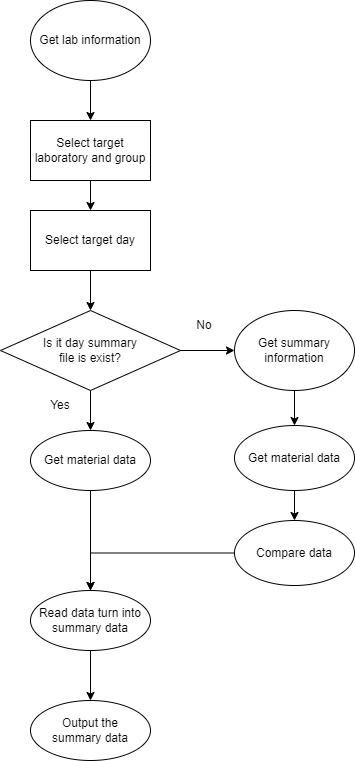

## 目的
毎週行われるゼミの議事録を自動的に生成するためのコード．
開発経緯は，議事録の作成時に抜き出す情報が個人個人の資料の初めの「進捗報告」と「今後の予定」のみであったため，人がやるべき作業ではないと感じたため自動化した．

## 利用方法

### セットアップ
`create_summary`を自分のPCにコピーしてください．\
`create_summary`下で以下のコマンドを実行してください．
```
pip install -r requirements.txt
```

### フォルダ構成
```
│  bullet_marks.txt
│  create_summary.py
│  create_summary_general.py
│  create_test.py
│  ignore.txt
│  README.md
│  requirements.txt
│  test_get_readme.py
│  test_member.txt
│  year_month_day.txt
│
├─member
│      2022_member.xlsx
│
├─out
├─pdf
│  │  test_pdf.py
│  │
│  └─研究室名
│      └─班名
│          └─日付
│
├─schedule
│      2022_schedule.csv
│
└─template
        name_year_month_day.pptx
```

<div style="page-break-before:always"></div>

### 使用
1. ゼミの日にまとめられているフォルダをpdfフォルダに入れる
2. `create_summary.py`を`create_summary`直下で実行
   ```
   py create_summary.py
   ```


## 注意
- 先週以前の議事録ファイルについてはoutからpdf内の該当フォルダに移動します.
  - 複数の議事録が乱立して，共有フォルダにコピーするときに編集後のファイルを上書きしないため
- 編集後はファイル名の中にある自分の名前を消してからアップロードしてください
  - 編集後のなのか編集前なのか分からなくなります．
- ローカルで編集してからアップロードするとき
  1. 編集する
  2. 自分の名前をファイル名から消す
  3. 共有フォルダにあるその日の自分の名前が書いてあるファイルを消す
     - 該当する日以外の自分の名前の書いてあるファイルを消さないでください． 
  4. 共有フォルダにアップロードする

## 班員のデータベースの構成
`year_member.xlsx`の構造

|学年|氏|名|セイ|メイ|氏名|セイメイ|学籍番号|メアド|研究室|大臣|研究班|
|:---:|:---:|:---:|:---:|:---:|:---:|:---:|:---:|:---:|:---:|:---:|:---:|


<div style="page-break-before:always"></div>

## フローチャート
<div align="center">
  
</div>

<div style="page-break-before:always"></div>

## 次の課題
- [x] create_summaryのモジュール化
  - [x] get_lab_data
  - [x] read_summary
  - [x] read_material
  - [x] make_summary
- [ ] create_summaryのウェブアプリ化
  - [ ] 設定
    - [ ] 参照フォルダの指定
    - [ ] 予定の追加
  - [ ] 議事録表示
    - [x] ある一意の班の情報のみを表示するコンポーネントを作成
    - [ ] 特定の人の議事録を表示
    - [ ] 全体への連絡事項を表示
    - [ ] 記録者の表示
  - [ ] 議事録読み込み
    - [ ] 研究室の指定
    - [ ] 班の指定
    - [ ] 出力日の指定
    - [ ] Loadの実装
  - [ ] 議事録修正・更新
    - [x] 表示で全ての議事録を編集可能な状態で表示
    - [ ] Saveの実装

<div style="page-break-before:always"></div>

## 工夫した点
1. この `README.md`を読み込んで、資料から読み出すタイトルを決定したこと。
2. 議事録にメモをした後に、資料をアップロードしてもメモの内容を保持して、資料の内容を追記するようにしたこと。
3. 個人情報をプログラム外にあるファイルから取得するようにしたこと。
4. 1つの巨大なファイルで完結するのではなくモジュール化して分解したこと。

<div style="page-break-before:always"></div>

下記の`<!-- title -!>`をタイトルとするページを資料内に作成して下さい．

## Rule
- 作成資料に必要な項目
  - 進捗報告 <!-- title -!>
  - 今後の予定 <!-- title -!>
  - 参考文献 <!-- title -!>
    - 論文
    - 学会誌
    - 参考にした技術ブログ
    - ショッピングサイト
    - 本
    - Githubのリンク
    - etc..
  - 作成物 <!-- title -!>
    - 共有サーバ内のリンク
      - 書いたコード
      - 何かのマニュアル
  - その他 <!-- title -!>
    - 所感

